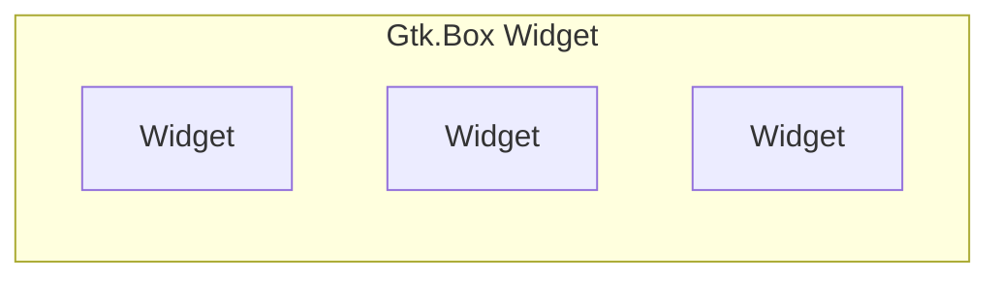
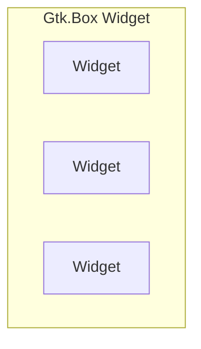
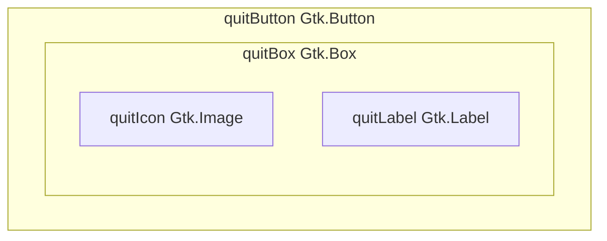
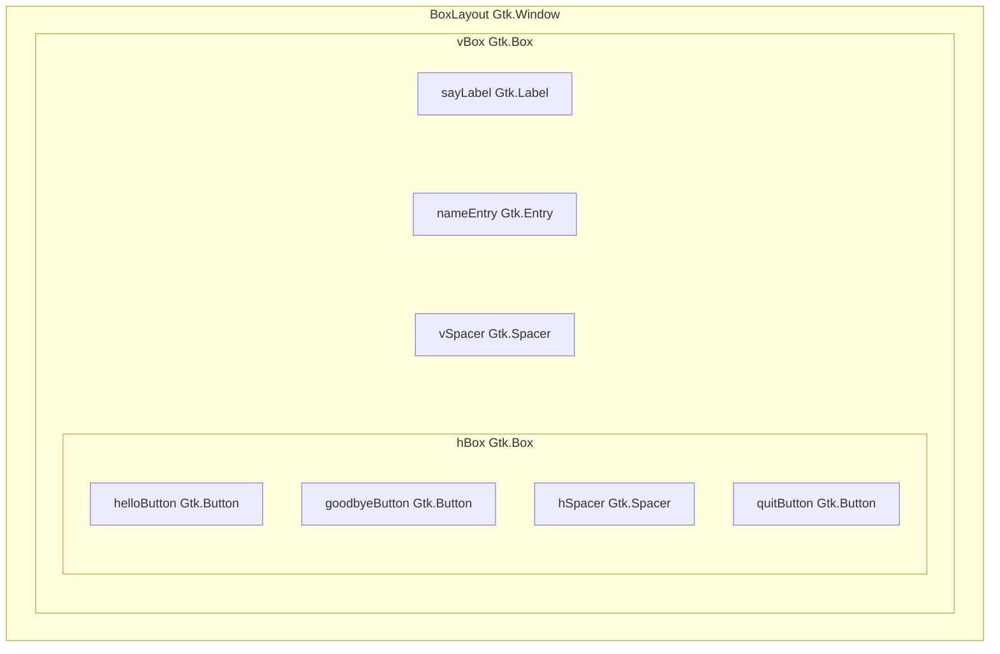

+++
date = '2024-12-12'
title = 'Using Gtk4 With C# and Gir.Core Box Layout Tutorial'
description = 'In this box layout tutorial, you will learn how to build a C# Gtk Application that makes use of the box layout to display multiple widgets both vertically and horizontally. You will also learn how to use a box layout to display an icon and a label inside a Gtk.Button widget.'
tags = ['Tech', 'Programming', 'CSharp', 'GTK']
bannerId = 'web-dev'
draft = false
+++
> [!NOTE]
> When I first looked at creating a GTK4 C# application using Gir.Core there was no documentation so I had to learn it through trial and error and looking at GTK in other programing languages. When I got my head around how to do this I created some tutorials and contributed them to the Gir.Core project.
>
> This is dual posted here so people can see content that I have created over time. You can find the official Gir.Core documentation at [https://gircore.github.io/](https://gircore.github.io/). 
>
> Please consider expanding the tutorials further if you go on to use it for creating applications.

> [!TIP]
> When learning GUI frameworks like GTK, QT and wxWidgets it is common to teach the basics using code to make the learning experience easier. In a real life GTK application you will probably want to create a ui file using either [GTK Builder XML](https://docs.gtk.org/gtk4/class.Builder.html) or [Blueprint](https://jwestman.pages.gitlab.gnome.org/blueprint-compiler/) to build the UI.
> 
> On the internet you will often see Glade mentioned for building GUIs in a user friendly wysiwyg editor. Glade does not work with Gtk 4 however there is a new project [Cambalache](https://gitlab.gnome.org/jpu/cambalache) which will build GUIs in a similar way to the old Glade project that was used in GTK 2/3.
> 
> If you want to use Blueprint to build your UI then you can use [Workbench](https://apps.gnome.org/en-GB/Workbench/) to see a preview as you write the blueprint.

# Box Layout Gtk Tutorial

In this box layout tutorial, you will learn how to build a C# Gtk Application that makes use of the box layout to display multiple widgets both vertically and horizontally.

You will also learn how to use a box layout to display an icon and a label inside a Gtk.Button widget.

We will begin by going to the `GtkTutorials` directory in the terminal. This directory was created in the previous `Hello World` tutorial. If you have not done that tutorial then you can follow that tutorial to get the directory structure set up for following this tutorial series.

Now run the following commands.

```bash
dotnet new console -f net8.0 -o BoxLayout
dotnet sln add BoxLayout/
cd BoxLayout
dotnet add package GirCore.Gtk-4.0 --version 0.5.0
```

With these commands you created a new BoxLayout project, added it to the sln file for people who use IDEs and added the Gir.Gtk-4.0 package to the project.

> [!TIP]
> You can check for newer versions by visiting the nuget website at [https://www.nuget.org/packages/GirCore.Gtk-4.0/#versions-body-tab](https://www.nuget.org/packages/GirCore.Gtk-4.0/#versions-body-tab).

We will now create a new class file to make the BoxLayout window in Gtk. This will be loaded from the `Program.cs` file and will be the main window of the application.

```bash
dotnet new class -n BoxLayout
```

Now open the BoxLayout directory in your favourite code editor or ide so we can edit the project files.

> [!NOTE]
> The code is commented to tell you what is happening. In addition to these comments, the highlighted lines will be discussed further after the code block to give you more information.

**Filename: Program.cs**
```csharp { linenos=inline hl_lines="7 18" }
// Create a new GTK application instance.
// "com.example.boxlayout" is the unique application ID used to identify the app.
// The application ID should be a domain name you control.
// If you don't own a domain name you can use a project specific domain such as github pages.
// e.g. io.github.projectname
// Gio.ApplicationFlags.FlagsNone indicates no special flags are being used.
var application = Gtk.Application.New("com.example.boxlayout", Gio.ApplicationFlags.FlagsNone);

// Attach an event handler to the application's "OnActivate" event.
// This event is triggered when the application is started or activated.
application.OnActivate += (sender, args) =>
{
    // Create a new instance of the main application window.
    // The application variable storing the Gtk.Application instance is passed to
    // the new instance of the BoxLayout window so that the window can access the
    // Gtk.Application instance, this is useful for closing the application from
    // a button.
    var window = new BoxLayout.BoxLayout(application);

    // Set the "Application" property of the window to the current application instance.
    // This links the window to the application, allowing them to work together.
    window.Application = (Gtk.Application) sender;

    // Show the window on the screen.
    // This makes the window visible to the user.
    window.Show();
};

// Start the application's event loop and process user interactions.
// RunWithSynchronizationContext ensures proper thread synchronization for GTK.
// The "null" parameter takes the arguments from the commandline. As there are no arguments
// supported in this tutorial the parameter is not filled and thus null.
return application.RunWithSynchronizationContext(null);
```

You will notice that the `Program.cs` file is almost identical to the one in the previous `Hello World` tutorial. The `Program.cs` file is usually the same boilerplate code that loads the window to display and the only changes are on the highlighted lines 7 and 18.

**Line 7:**
```csharp
var application = Gtk.Application.New("com.example.boxlayout", Gio.ApplicationFlags.FlagsNone);
```

On line 7 we changed the application id which is the reverse dns domain `com.example.boxlayout` this will be unique for each application and should be a domain you own. If you do not own a domain then you can use a project specific domain like `io.github.projectname` that is unique to your project.

**Line 18:**
```csharp
var window = new BoxLayout.BoxLayout(application);
```

On line 18 we changed the window class that is being used to display the window which in this case is `BoxLayout.BoxLayout` this is `namespace.class_name`. We are also passing in a `Gtk.Application` argument with the variable `application` which is the instance of `Gtk.Application` which is being used for this Gtk Application we are building.

By passing the `Gtk.Application` instance to the `BoxLayout` object we will have access to things in `Gtk.Application` from the window created by the `BoxLayout` class, this is useful for adding menus, quit buttons etc.

Now that the `Program.cs` file is setup we need to build the window for the application. We will do this by adding the following code to the `BoxLayout.cs` file.

> [!NOTE]
> The code is commented to tell you what is happening. In addition to these comments, the highlighted lines will be discussed further after the code block to give you more information.

**Filename: BoxLayout.cs**
```csharp { linenos=inline hl_lines="11 24 39 41 44 46-47 50 88-89 98-99 123" }
namespace BoxLayout
{
    // Define a class named BoxLayout that extends Gtk.Window.
    // Gtk.Window represents a top-level window in a GTK application.
    public class BoxLayout : Gtk.Window
    {
        // Constructor for the BoxLayout class.
        // This method sets up the window and its contents.
        // Gtk.Application is passed in so we can access the application in this app
        // we will use the reference to the Gtk.Application to quit from a button.
        public BoxLayout(Gtk.Application app)
        {
            Title = "Box Layout App";
            SetDefaultSize(300, 30);

            var helloButton = Gtk.Button.New();
            helloButton.Label = "Say Hello"; // Same as helloButton.SetLabel("Say Hello")
            helloButton.SetMarginStart(10);  // Left margin
            helloButton.SetMarginEnd(10);    // Right margin
            helloButton.SetMarginTop(10);    // Top margin
            helloButton.SetMarginBottom(10); // Bottom margin

            // Create a Gtk.Button widget and set the label when it is created
            var goodbyeButton = Gtk.Button.NewWithLabel("Say Goodbye");
            goodbyeButton.SetMarginStart(10);  // Left margin
            goodbyeButton.SetMarginEnd(10);    // Right margin
            goodbyeButton.SetMarginTop(10);    // Top margin
            goodbyeButton.SetMarginBottom(10); // Bottom margin

            // A Gtk.Button can only display a Label or an Icon but not both together
            // Gtk.Button with label: var button = Gtk.Button.NewWithLabel("Label");
            // Gtk.Button with icon: var button = Gtk.Button.NewFromIconName("icon-name");
            // To have multiple widgets inside a Gtk.Button you can set the child of the
            // button to be a Gtk.Box as shown below.
            var quitButton = Gtk.Button.New();
            // Create a Gtk.Box that can hold multiple widgets. Orientation is set
            // to horizontal which will display widgets side by side.
            // there is a 10px gap between each new widget in the box.
            var quitBox = Gtk.Box.New(Gtk.Orientation.Horizontal, 10);
            // Create a label that allows user to press Alt+Q to act as button press.
            var quitLabel = Gtk.Label.NewWithMnemonic("_Quit");
            // Icon Names come from https://specifications.freedesktop.org/icon-naming-spec/latest/
            // The theme needs to have the icon. Gtk Apps by default use the Adwaita theme from Gnome
            var quitIcon = Gtk.Image.NewFromIconName("application-exit");
            // This will add the quitIcon and quitLabel widgets into the quitBox.
            quitBox.Append(quitIcon);
            quitBox.Append(quitLabel);
            // Sets the quitBox as the child of the quitButton so that the contents
            // of the quitBox will display inside the button.
            quitButton.SetChild(quitBox);
            quitButton.SetMarginStart(10);  // Left margin
            quitButton.SetMarginEnd(10);    // Right margin
            quitButton.SetMarginTop(10);    // Top margin
            quitButton.SetMarginBottom(10); // Bottom margin

            // Create a Gtk.Label with a blank label
            var sayLabel = Gtk.Label.New("");
            sayLabel.SetMarginStart(10);  // Left margin
            sayLabel.SetMarginEnd(10);    // Right margin
            sayLabel.SetMarginTop(10);    // Top margin
            sayLabel.SetMarginBottom(10); // Bottom margin

            // Create a Gtk.Entry and then set placeholder text telling the user
            // what they need to do.
            var nameEntry = Gtk.Entry.New();
            nameEntry.PlaceholderText = "Enter your name";
            nameEntry.SetMarginStart(10);  // Left margin
            nameEntry.SetMarginEnd(10);    // Right margin
            nameEntry.SetMarginTop(10);    // Top margin
            nameEntry.SetMarginBottom(10); // Bottom margin

            // Creates a Gtk.Box widget with a vertical orientation.
            // This will allow you to add multiple widgets stacked vertically
            // with each new appended widget stacking below the widget above it.
            var vBox = Gtk.Box.New(Gtk.Orientation.Vertical, 0);

            // Creates a Gtk.Box widget with a horizontal orientation.
            // This will allow you to add multiple widgets stacked horizontally
            // with each new appended widget stacking to the right of the widget 
            // beside it.
            var hBox = Gtk.Box.New(Gtk.Orientation.Horizontal, 0);

            // Creates a Gtk.Box widget with a vertical orientation.
            // Then the SetVexpand is set to true so the widget takes up all the
            // available vertical space between the widgets above it and below it.
            // This is useful to make the widgets below the spacer be at the bottom
            // of the window even when it is resized to be larger or smaller.
            var vSpacer = Gtk.Box.New(Gtk.Orientation.Vertical, 0);
            vSpacer.SetVexpand(true);

            // Creates a Gtk.Box widget with a horizontal orientation.
            // Then the SetHexpand is set to true so the widget takes up all the
            // available horizontal space between the widgets to the left and 
            // the widgets to the right of it.
            // This is useful to make the widgets to the right of the spacer be 
            // at the right of the window even when it is resized to be larger 
            // or smaller.
            var hSpacer = Gtk.Box.New(Gtk.Orientation.Horizontal, 0);
            hSpacer.SetHexpand(true);

            // This will add the widgets to the vBox Gtk.Box widget with each new
            // append adding the new widget below the one above it.
            vBox.Append(sayLabel);
            vBox.Append(nameEntry);
            // The vSpacer is used to create a gap between the widgets above and
            // below the vSpacer. It will force the widgets in the hBox to be at
            // the bottom of the window.
            vBox.Append(vSpacer);
            vBox.Append(hBox);

            // This will add the widgets to the hBox Gtk.Box widget with each new
            // append adding the new widget to the right of the one beside it.
            hBox.Append(helloButton);
            hBox.Append(goodbyeButton);
            // the hSpacer is used to create a gap between the widgets to the left
            // and the widgets to the right of the hSpacer. It will force the 
            // quitButton to be at the right of the window.
            hBox.Append(hSpacer);
            hBox.Append(quitButton);

            // This sets the child of the window to be the vBox Gtk.Box widget.
            // This will show all the widgets in the vBox in the window.
            Child = vBox;

            helloButton.OnClicked += (_, _) =>
            {
                // Sets the label to say Hello and then the value the user typed 
                // into the nameEntry widget.
                sayLabel.SetLabel($"Hello {nameEntry.GetText()}");
            };

            goodbyeButton.OnClicked += (_, _) =>
            {
                // Sets the label to say Goodbye and then the value the user typed 
                // into the nameEntry widget.
                sayLabel.SetLabel($"Goodbye {nameEntry.GetText()}");
            };

            quitButton.OnClicked += (_, _) =>
            {
                app.Quit();
            };
        }
    }
}

```

**Line 11:**
```csharp
public BoxLayout(Gtk.Application app)
```

On line 11 you will see that in the `BoxLayout` constructor we have a parameter for `Gtk.Application` and assign it the variable `app`. This will give us access to the running `Gtk.Application` and is useful for things like adding a quit button, adding menu item actions etc.

**Line 24:**
```csharp
var goodbyeButton = Gtk.Button.NewWithLabel("Say Goodbye");
```

On line 24 you will see that we are adding a `Gtk.Button` widget and using the `NewWithLabel()` method to create the `Gtk.Button` without having to use `goodbyeButton.SetLabel("Button Label");` or `goodbyeButton.Label = "Button Label";` after the button is declared.

**Line 39:**
```csharp
var quitBox = Gtk.Box.New(Gtk.Orientation.Horizontal, 10);
```

On line 39 we are adding a `Gtk.Box` which is used to display multiple widgets at the same time. In this instance, we are using it to show both an `Icon` and a `Label` inside the `Gtk.Button` widget that is being used as a quit button.

We are setting `Gtk.Orientation.Horizontal` which will make the widgets appear side by side with each new widget being added at the end.

The value `10` is the gap in pixels that is between each widget that is added to the `Gtk.Box`.

**Example of Gtk.Box with horizontal orientation and 3 widgets inside:**


**Example of Gtk.Box with vertical orientation and 3 widgets inside:**


**Line 41:**
```csharp
var quitLabel = Gtk.Label.NewWithMnemonic("_Quit");
```

On line 41 we are creating a `Gtk.Label` to use as a label on our quit button. We are using the `NewWithMnemonic()` method to create a label that has the mnemonic `Alt+Q` which will act as the button being clicked when the user presses `Alt+Q`.

**Line 44:**
```csharp
var quitIcon = Gtk.Image.NewFromIconName("application-exit");
```

On line 44 we are creating a `Gtk.Image` to use as an icon for our quit button. We are using the `NewFromIconName()` method to assign the icon `application-exit` when declaring the `quitIcon` variable. 

> [!NOTE]
> `application-exit` is an icon name that is part of the [Free Desktop Icon Theme Specification](https://specifications.freedesktop.org/icon-naming-spec/latest/) and is used by many desktop environments. If Gtk cannot find the icon name then it will show a broken image icon to indicate it could not find the icon.
>
> The `Icon Library` application can be used to browse and search icons. You can click icons to get additional information and it shows a sample of how to add the icon as a `gresource` to an application in multiple programming languages. The application can be downloaded from [FlatHub](https://flathub.org/apps/org.gnome.design.IconLibrary) or installed using your linux distributions package manager, usually, the package will be called `icon-library`.
> 
> Gtk Applications use the `Adwaita` icon theme by default. If you are not seeing the icons make sure that you have the theme installed. The theme package is usually called `adwaita-icon-theme` and can be installed using your package manager on Linux, [Home Brew](https://brew.sh/) on MacOS and [MSYS2](https://www.msys2.org/) on Windows.

**Lines 46 and 47:**
```csharp
quitBox.Append(quitIcon);
quitBox.Append(quitLabel);
```

On lines 46 and 47, we are appending the `quitIcon` and `quitLabel` widgets to the `quitBox`. As this is a `Gtk.Box` with a `horizontal` orientation the widgets will be shown side by side.

**Line 50:**
```csharp
quitButton.SetChild(quitBox);
```

On line 50 we are setting the `quitButton` child to be the `quitBox` which will show the contents of the `quitBox Gtk.Box` inside the `quitButton Gtk.Button` widget.

**quitButton Gtk.Button child is now the quitBox Gtk.Box widget:**


> [!EXPERIMENT]
> `Append` adds widgets to the end of the `Gtk.Box` and `Prepend` adds widgets to the start of the `Gtk.Box`. Try experimenting with the code by changing the code to be as shown below and notice how the order of the `quitIcon` and `quitLabel` change position.
>
> ```csharp { style=emacs }
> quitBox.Prepend(quitIcon);
> quitBox.Prepend(quitLabel);
> ```

**Lines 88 and 89:**
```csharp
var vSpacer = Gtk.Box.New(Gtk.Orientation.Vertical, 0);
vSpacer.SetVexpand(true);
```

On line 88 we are making the `vSpacer` variable be an empty `Gtk.Box` widget with vertical orientation. This will be used to create blank space between the widgets at the top of the window and the widgets at the bottom of the window. We need to do this so that the widgets at the bottom of the window remain at the bottom when the window is resized.

On line 89 we use `SetVexpand(true)` to make the `vSpacer Gtk.Box` widget expand to take up all available space. By doing this the `vSpacer Gtk.Box` widget will push all widgets after it to the bottom of the window. 


**Lines 98 and 99:**
```csharp
var hSpacer = Gtk.Box.New(Gtk.Orientation.Horizontal, 0);
hSpacer.SetHexpand(true);
```

On line 98 we are making the `hSpacer` variable be an empty `Gtk.Box` widget with horizontal orientation. This will be used to create blank space between the widgets at the start (left) of the window and the widgets at the end (right) of the window. We need to do this so that the widgets at the end of the window remain at the end when the window is resized.

On line 99 we use `SetHexpand(true)` to make the `hSpacer Gtk.Box` widget expand to take up all available space. By doing this the `hSpacer Gtk.Box` widget will push all widgets after it to the end (right) of the window. 

**Line 123:**
```csharp
Child = vBox;
```

On line 123 you set the `Child` of the `BoxLayout Gtk.Window` widget to be the `vBox Gtk.Box` widget which makes the `BoxLayout Gtk.Window` have everything that is inside the `vBox Gtk.Box` widget.

**The BoxLayout Gtk.Window contents after making vBox the Child:**


**Run The BoxLayout Application:**

Now that you have entered the code needed for the application you can run the project.

```bash
dotnet run
```
If you have entered the code correctly and have the Gtk 4 runtime libraries installed correctly on your computer then you will see the Box Layout application window appear on the screen.

> [!EXPERIMENT]
> Try resizing the window and see how the vSpacer and hSpacer widgets push the widgets to the bottom and right sides of the window.

## Screenshots

Below are screenshots of the Box Layout application running on Linux, Windows and MacOS.


### Linux


### Windows


### MacOS



> [!TASK]
> There are two blog posts in this series:
> - [Using Gtk4 With C# and Gir.Core Hello World Tutorial](/blog/tech/programming/csharp/using-gtk4-with-csharp-and-gircore-hello-world-tutorial/)
> - [Using Gtk4 With C# and Gir.Core Box Layout Tutorial](/blog/tech/programming/csharp/using-gtk4-with-csharp-and-gircore-boxlayout-tutorial/)
