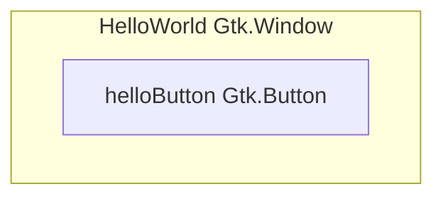

+++
date = '2024-12-11'
title = 'Using Gtk4 With C# and Gir.Core Hello World Tutorial'
description = 'In this hello world tutorial you will learn how to build a basic C# Gtk Application with a single Gtk Button widget inside it'
tags = ['Tech', 'Programming', 'CSharp', 'GTK']
bannerId = 'web-dev'
draft = false
+++
> [!NOTE]
> When I first looked at creating a GTK4 C# application using Gir.Core there was no documentation so I had to learn it through trial and error and looking at GTK in other programing languages. When I got my head around how to do this I created some tutorials and contributed them to the Gir.Core project.
>
> This is dual posted here so people can see content that I have created over time. You can find the official Gir.Core documentation at [https://gircore.github.io/](https://gircore.github.io/). 
>
> Please consider expanding the tutorials further if you go on to use it for creating applications.

> [!TIP]
> When learning GUI frameworks like GTK, QT and wxWidgets it is common to teach the basics using code to make the learning experience easier. In a real life GTK application you will probably want to create a ui file using either [GTK Builder XML](https://docs.gtk.org/gtk4/class.Builder.html) or [Blueprint](https://jwestman.pages.gitlab.gnome.org/blueprint-compiler/) to build the UI.
> 
> On the internet you will often see Glade mentioned for building GUIs in a user friendly wysiwyg editor. Glade does not work with Gtk 4 however there is a new project [Cambalache](https://gitlab.gnome.org/jpu/cambalache) which will build GUIs in a similar way to the old Glade project that was used in GTK 2/3.
> 
> If you want to use Blueprint to build your UI then you can use [Workbench](https://apps.gnome.org/en-GB/Workbench/) to see a preview as you write the blueprint.

## Hello World Gtk Tutorial
In this hello world tutorial you will learn how to build a basic C# Gtk Application with a single Gtk Button widget inside it.

We will begin by creating a `GtkTutorials` directory to contain the Gtk tutorials you do and create the HelloWorld project using the command line. 
```bash
mkdir GtkTutorials
cd GtkTutorials
dotnet new console -f net8.0 -o HelloWorld
dotnet new gitignore
dotnet new sln
dotnet sln add HelloWorld/
```

The above commands will create a new console project, a gitignore file and a solution file for the project with the HelloWorld project added to the solution file so that people using ide's can open the project easily. As you follow more Gtk tutorials you can create the projects in the `GtkTutorials` directory by using `dotnet new console -f net8.0 -o NewProject` and add the projects to the solution file by using `dotnet sln add NewProject` to have multiple projects in the same solution file.

Next we will download the GirCore.Gtk-4.0 nuget package into the project.

> [!TIP]
> You can check for newer versions by visiting the nuget website at [https://www.nuget.org/packages/GirCore.Gtk-4.0/#versions-body-tab](https://www.nuget.org/packages/GirCore.Gtk-4.0/#versions-body-tab).

```bash
cd HelloWorld
dotnet add package GirCore.Gtk-4.0 --version 0.5.0
```

The above commands will change to the HelloWorld directory then add the `GirCore.Gtk-4.0` package to the `HelloWorld.csproj` file.

We will now create a new class file to use to make the HelloWorld window in Gtk. This will later be loaded from the `Program.cs` file.

```bash
dotnet new class -n HelloWorld
```

Next open the `HelloWorld` directory in your favourite code editor or ide so we can edit the `HelloWorld.cs` and `Program.cs` files.

> [!NOTE]
> The code is commented to tell you what is happening. In addition to these comments the highlighted lines will be discussed further after the code block to give you more information.

**Filename: HelloWorld.cs**
```csharp { linenos=inline hl_lines="37" }
namespace HelloWorld
{
    // Define a class named HelloWorld that extends Gtk.Window.
    // Gtk.Window represents a top-level window in a GTK application.
    public class HelloWorld : Gtk.Window
    {
        // Constructor for the HelloWorld class.
        // This method sets up the window and its contents.
        public HelloWorld()
        {
            // Set the title of the window.
            Title = "Hello World App";

            // Set the default size of the window to 300 pixels wide and 30 pixels tall.
            // This is the initial size when the window is first displayed.
            SetDefaultSize(300, 30);

            // Create a new button widget.
            // Gtk.Button is a clickable UI element.
            var helloButton = Gtk.Button.New();

            // Set the text label displayed on the button.
            helloButton.Label = "Say Hello";

            // Add margins around the button to create spacing from the edges of the window.
            // Margins are specified in pixels.
            helloButton.SetMarginStart(10);  // Left margin
            helloButton.SetMarginEnd(10);    // Right margin
            helloButton.SetMarginTop(10);    // Top margin
            helloButton.SetMarginBottom(10); // Bottom margin

            // Add the button to the window.
            // The `Child` property represents the main widget contained in the window.
            // Here, we set the button as the only child of the window.
            // In a real application you would set the child to be one of the Gtk Layout widgets 
            // so you can have multiple widgets in the window.
            Child = helloButton;

            // Attach an event handler to the button's "OnClicked" event.
            // This event is triggered when the user clicks the button.
            helloButton.OnClicked += (_, _) =>
            {
                // Print "Hello World!" to the console when the button is clicked.
                Console.WriteLine("Hello World!\n");
            };
        }
    }
}
```


**Line 37:**

On line 37 you set the `Child` of the `HelloWorld Gtk.Window` to be the `HelloWorld Gtk.Button`. 

It may be easier to understand visually by looking at the diagram below.



As you can see the window is entirely made up of the `helloButton Gtk.Button` widget. In a real application you will use a `Layout Widget` like the `Gtk.Box` widget to have multiple widgets inside the window.

**Filename: Program.cs**
```csharp { linenos=inline }
// Create a new GTK application instance.
// "com.example.helloworld" is the unique application ID used to identify the app.
// The application ID should be a domain name you control. 
// If you don't own a domain name you can use a project specific domain such as github pages. 
// e.g. io.github.projectname
// Gio.ApplicationFlags.FlagsNone indicates no special flags are being used.
var application = Gtk.Application.New("com.example.helloworld", Gio.ApplicationFlags.FlagsNone);

// Attach an event handler to the application's "OnActivate" event.
// This event is triggered when the application is started or activated.
application.OnActivate += (sender, args) =>
{
    // Create a new instance of the main application window.
    var window = new HelloWorld.HelloWorld();

    // Set the "Application" property of the window to the current application instance.
    // This links the window to the application, allowing them to work together.
    window.Application = (Gtk.Application) sender;

    // Show the window on the screen.
    // This makes the window visible to the user.
    window.Show();
};

// Start the application's event loop and process user interactions.
// RunWithSynchronizationContext ensures proper thread synchronization for GTK.
// The "null" parameter takes the arguments from the commandline. As there are no arguments
// supported in this tutorial the parameter is not filled and thus null.
return application.RunWithSynchronizationContext(null);
```
**Run the HelloWorld Application:**

Now we have completed the code for the hello world tutorial we can run the project.

```bash
dotnet run
```

If you have entered the code correctly and have the Gtk 4 runtime libraries installed correctly on your computer then you will see the Hello World application window appear on the screen.

> [!EXPERIMENT]
> Try resizing the window to see that the `helloButton Gtk.Button` widget takes up the entire window with a 10 pixel margin around it.

## Screenshots


### Linux


### Windows


### MacOS



> [!TASK]
> There are two blog posts in this series:
> - [Using Gtk4 With C# and Gir.Core Hello World Tutorial](/blog/tech/programming/csharp/using-gtk4-with-csharp-and-gircore-hello-world-tutorial/)
> - [Using Gtk4 With C# and Gir.Core Box Layout Tutorial](/blog/tech/programming/csharp/using-gtk4-with-csharp-and-gircore-boxlayout-tutorial/)
